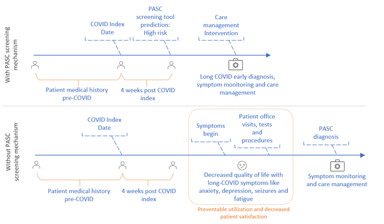
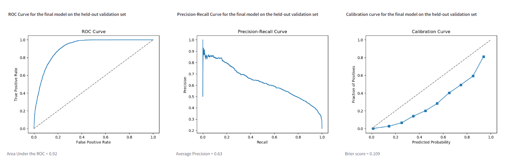
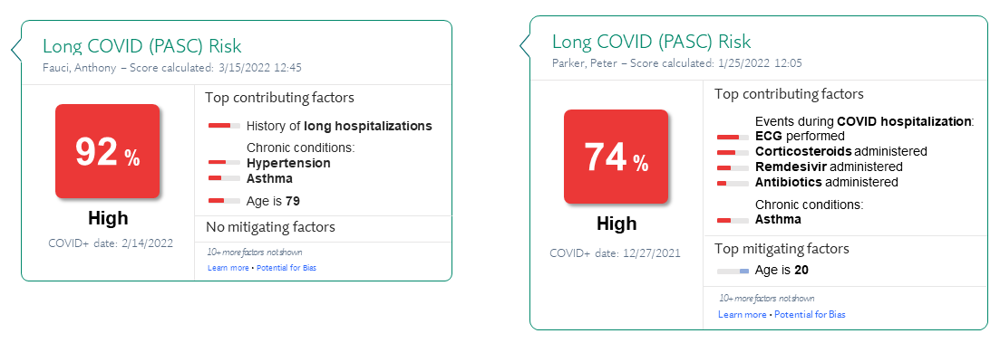
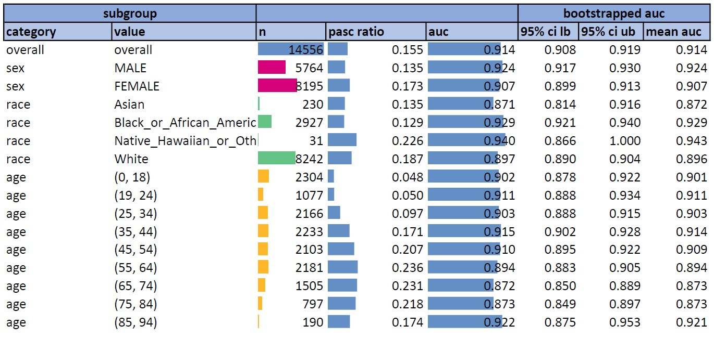

# GAIL Long COVID Prediction Model
Biplab Bhattacharya, Grant Delong, Elliot Mitchell, Tamanna Munia, Gaurav Shetty, Abdul Tariq

Steele Institute for Health Innovation, Geisinger

## Summary Sentence
We present a PASC prediction model for population-level screening and risk stratification using an XGBoost classifier tuned to have high recall, and designed to be integrated into the clinical workflow.

## Background/Introduction
We focused on creating a long COVID prediction model that has a high likelihood of clinical deployment and acceptance, rather than a model with the best statistical performance. 

Our reasoning was based on the observation that despite the preponderance of highly accurate clinical prediction models in the academic literature, clinical implementations and operational integration are notably lacking [1]. Even for models deployed in clinical practice, surveys of clinicians suggest that many of these models are considered irrelevant, if not a nuisance [2]. We believe that this gap between theory and practice results from a misplaced emphasis on statistical performance over operational factors that affect real-world utility. For example, through multiple successful deployments of clinical prediction models at Geisinger [3, 4, 5] we have found that models with even modest AUROC, AUPRC, F-1 scores, etc. can be immensely useful if some additional criteria are met, such as:

1. Carefully assessing where the predictive model fits in a clinical workflow and what specific pain point it addresses 
2. Providing interpretable explanations for model predictions
3. Linking model predictions to potential care pathways

By constraining ourselves to build a model that is implementation ready, we made a number of trade-offs: 

1. Using a parsimonious set of variables available from almost all patients, rather than a more extensive feature set available only for a minority of patients
2. Imputing missing values through simple, clinically intuitive techniques rather than complex data-mining methods unlikely to generalize to a real-world setting [6]
3. Using classical machine learning techniques over more advanced deep learning methods to provide model transparency and interpretability [7]

While these constraints might lower the statistical performance of our model, we believe they increase the likelihood of the model being implemented.

**Figure 1.** Potential care timelines for a patient likely to be diagnosed with long COVID (PASC)

In our approach, we started by observing that the etiology of long COVID is presently not well-understood and there is noise in the PASC/No PASC labels. Therefore, even a perfectly predictive model on this dataset will miss long COVID cases in a real setting. Knowing this, doctors are likely to use the prediction model for risk stratification and screening, rather than diagnosing long COVID (see Figure 1). As such, our model focuses on having high recall so that the largest share of potentially positive cases are flagged for follow-up. 

Moreover, we only use a limited set of features for modeling because we assumed that when deployed, say, in an outpatient setting, for many patients the model will not have rich medical histories to rely upon for prediction. We imputed missing values through simple heuristics that reflect the realities of medical data collection so that our model generalizes better. We favored classical machine learning techniques so we can generate clinically relevant explanations for our predictions, which in turn would engender trust and increase adoption, even if more advanced techniques provide slightly better performance.

## Methods
### Feature selection
We used 257 features in the model (76 features x 3 time-points (before, during, after); 2 features x 2 time-points (before, after), 29 features). These spanned seven broad categories: demographics (age, sex, weight and height; notably excluding race as a feature to mitigate potential bias, a strategy being followed in the development of other clinical prediction models [8]); laboratory results (complete blood count, basic metabolic panel, ALT, AST, c-reactive protein, and albumin); vitals (heart rate, respiratory rate, blood pressure, and oxygen saturation); chronic condition diagnoses (for asthma, COPD, heart failure, hypertension, diabetes, and obesity), and a binary indicator for tobacco use; procedures (ventilator use, chest imaging orders, lungs CT scan and ultrasound performed, ECG and Echocardiogram procedure, and whether there was ECMO needed during hospitalization episodes); utilization and hospitalization characteristics (visit type (inpatient, outpatient, emergency, or telephone), hospital length-of-stay, ICU length-of-stay); and medications (asthma, anticoagulants, corticosteroids, antibiotics, antivirals, lopinavir, IV immunoglobulin, remdesivir, paxlovid).

For each feature, we used a concept set to group relevant OMOP concepts. Where appropriate, we using existing concept sets in the enclave, with a preference for N3C Recommended concept sets, and reviewed each concept set thoroughly for applicability. If a concept set did not already exist, we created one. For lab values and vitals, we additionally filtered measurements based on their unit concepts.

### Feature processing
We divided each patient’s longitudinal record into three distinct observation windows (named “before”, “during”, and “after) based on the COVID test date and whether the test date overlapped with a macrovisit:

- If the COVID test date overlapped with a macrovisit: 
  - Before: All measurements prior to the start of the macrovisit 
  - During: All measurements from the macrovisit
  - After: All measurements after the end of the macrovisit
- If the COVID test did not overlap with a macrovisit: 
  - Before: All measurements prior to the COVID test date
  - During: All measurements co-incident with the COVID test date
  - After: All measurements after the COVID test date

For time-varying numeric features (laboratory results for instance), all measurements within a given window were averaged to yield a single value per patient per window. For time-varying binary features (such as the presence/absence of a particular diagnosis), the feature was set to 1 if the condition existed at any point within the window, and zero otherwise. 

### Missing data imputation
In healthcare data it is often the case that missing values are informative. For instance, the absence of a particular laboratory result indicates that the corresponding test was not ordered, likely because the pre-test probability of an abnormal result was deemed too low. In such a case, rather than favoring a complex, data-driven imputation approach that is likely to yield only marginal benefits, we chose to use simple heuristics to handle missing values as outlined below:  

- Demographics: missing values for age were imputed as -1; missing categorical values were set to 0.
- Lab results: all missing lab components were imputed as -1. 
- Vitals: all missing vitals were imputed as -1. 
- Diagnoses: features for a particular diagnoses were set to 0 if no concept code associated with a particular condition was coded.
- Procedures: features for procedures were set to 0 if no procedure codes associated with a particular procedure were coded. 
- Utilization: missing length-of-stay was imputed as -1 (for both hospital and ICU). Counts for visit types (ED, IP, Outpatient, Telephone) were set to 0 if no visits were present within the window for a patient.
- Medications: features for a particular medication were set to 0 if no concept code associated with that medication was coded.

### Model training and evaluation
Our final model was an extreme gradient boosted decision tree (XGBoost) for classifying whether a patient developed PASC or not.  XGBoost is an open-source software library and an implementation of gradient boosting with a high focus on scalability, parallelization and distributed execution. The censored training data were processed to yield an analytic dataset with a single row per patient. The analytic dataset was randomly split into a training dataset (75% of patients) and an independent validation dataset (25% of patients). GridSearchCV was used to determine the optimal parameters for the classifier: max depth = 8, learning rate (eta) = 0.05, colsample_bytree = 0.5 (to add randomness to make training robust to noise), lambda = 1.5 (for regularization) and scale_pos_weight = 5 (to balance the positive and negative weights). The remaining parameters were set to the default values provided in the packages. 

Other classical classifiers (Logistic regression, Decision tree, Random Forest, Gradient-boosted tree and Multilayer perceptron) were also investigated with the same benchmark datasets. The efficacy of different models was evaluated in terms of f1 score, precision, recall and area under the ROC (AUROC) curve. Table 1 presents the performance of each classifier on the validation set. The XGBoost model has the highest AUROC, F1 score as well as recall. 

**Table 1.** Classifier performance on the validation data
| **Model**                 | recall | AUROC | precision | f1_score |
| ------------------------- | ------ | ----- | --------- | -------- |
| **Logistic regression**   | 0.71   | 0.84  | 0.39      | 0.51     |
| **Decision tree**         | 0.46   | 0.68  | 0.45      | 0.46     |
| **Random forest**         | 0.41   | 0.90  | 0.69      | 0.52     |
| **Gradient-boosted tree** | 0.35   | 0.89  | 0.68      | 0.47     |
| **Multilayer perceptron** | 0.20   | 0.82  | 0.50      | 0.28     |
| **XGBoost**               | 0.81   | 0.92  | 0.50      | 0.62     |

Our final model used XGBoost with recall = 81%, AUROC = 0.92, average precision = 0.63, and an F-1 score = 0.62.

**Performance plots for the final XGBoost model:**

### Methods for Model Interpretability and Workflow Integration
In real-world machine learning implementations at Geisinger Health, we have found that using predictive models to flag high-risk patients for reprioritization and/or confirmatory follow-up screening is a cost-effective and high-value approach for healthcare care delivery. We have successfully used this approach to screen for colorectal cancer, intracranial hemorrhage, and high-risk influenza [3, 4, 5], and the same approach is being applied for numerous additional conditions. 

In these programs, machine learning models supplement rather than replace clinical judgment by providing a subset of patients to where additional resources can be allocated. Therefore, our emphasis is on using models with high recall rates, to identify as many patients with PASC as possible, early in patient’s healthcare journeys. This approach can increase the yield of PASC screening, increasing the proportion of patients with PASC among those who are screened. 

To support clinical decision-making, we 1) accompany each risk prediction with a set of the top contributing factors for the risk score, and 2) can embed predictions within the clinical workflow. 

To summarize the reasons why a particular individual is flagged as high risk, we calculate Shapley values to create local explanations of the features that contribute most to the patient’s risk score. However, the largest Shapley values may not surface relationships that are clinically meaningful, and Shapely-based visualizations can be difficult and time consuming for clinical end users to interpret. Instead, we map features and Shapley values to broader, clinically relevant factors, presenting them as a brief narrative of the top contributing factors for each patient. 

In addition, risk scores and the top factors can be integrated into the clinical workflow, for example by integrating with the Epic electronic health record (EHR) used at Geisinger and many of the largest health systems in the US. The specifics of the integration depend on the workflows that make the most sense for a given organization. Risk scores can be integrated into patient worklists for proactive outreach from nurses, embedded into the header bar and summary report during discharge planning, or to trigger messages to primary care offices and support staff. An example risk score display is presented in Figure 2.

## Conclusion/Discussion
We developed a prediction model for long COVID (PASC), envisioning its deployment as part of a population-level screening and stratification program. Using a parsimonious set of features, our model achieved an AUROC of 0.92, comparable to existing models using EHR-based datasets [9, 10]. With a recall of 81%, our model is suitable for first-line screening, triage, and surveillance of patients suspected to be at high-risk for developing long COVID. 

### Explanations and Workflow Integration
As a tool for clinical decision support, GAIL Long COVID Risk scores can be presented to clinical end users like physicians and nurses, and include a summary of continuing factors, based on Shapley values. We chose two cases to illustrate the way that explanations can vary between patients. These are actual patent examples from the challenge training data set. 

Figure 2 shows, side-by-side, how the Long COVID (PASC) Risk score and top contributing factors would be presented to end users in Epic. You can see that, while both risk scores are high, each narrative identifies a different set of features. These top contributing and mitigating factors are based on the weights of the Shapley values, presented in Figures 3 and 4, but synthesized into a brief, clinically relevant summary. 

**Figure 2.** Long COVID (PASC) Risk predictions for Patient 1 (left) and Patient 2 (Right), as displayed in the Epic EHR 

Patient 1 is a 79-year-old who was not hospitalized for their COVID index, but does have a number of risk factors including hypertension and asthma, and a history of hospitalizations with a long length of stay. Our model estimated at 92% chance of developing PASC, and they did indeed develop long COVID after the index data range. A summary of the top features, sorted by shapely values, is presented in Figure 3. 

In contrast with Patient 1, Patient 2 (Figure 4) is only 20 years old, leading one to think they should be lower risk for PASC. However, Patient 2 was admitted during their COVID index, and had a long, complicated hospital stay. Our model estimated a 74% chance of developing long COVID, which they did eventually screen positive for. 

**Figure 3.** Shapley values indicate that patient 1's average length of stay, hypertension, asthma drugs, and age are among the top reasons for a high risk score of 92%

**Figure 4.** Shapley values indicate that patient 2's ECG performed during the COVID Index date range, as well as corticosteroids and remdesivir being administered, contribute to their high risk score of 74%. 

### Sub-group analyses for bias/fairness
In Table 2, below, we show that the performance of the model in various demographic subgroups of the data, denoted by the subgroup category and value columns. We found that AUCs were comparably performant across most subgroups. However, the model tends to perform slightly better for black patients and slightly worse for white patients. 

**Table 2.** Model performance across various demographic subgroups

### Limitations and future directions
Several improvements can be made to improve model performance in subsequent work. More sophisticated methods could be employed to encode the temporal structure of patient measurements. Rather than encoding patient trajectories to just three time-points, for instance, functional regression could be used to incorporate the entire time-series of inputs. Important information regarding the severity of patient status could be incorporated from clinical notes associated with prior visits. The set of diagnosis and procedure codes as well as medication orders could also be expanded. 

In addition, improvements could also be made to increase the real-world utility and suitability of the model. For example, rather one model for a heterogenous population, multiple models could be trained on natural subsets within data based on patient characteristics (for instance an outpatient-only model for patients with limited inpatient medical histories; a more detailed model for hospitalized patients, etc.).

### Conclusion
As research into understanding Long COVID (PASC) progresses, precision and diagnostic accuracy will become more important. We use our deployment experience to develop potential displays that employ principles to avoid alert fatigue by integrating the display into existing EHR systems. The model presented provides an effective first-cut screening pathway for early and preventative interventions, thus improving patient outcomes.

## References
[1] Seneviratne, Martin G., Nigam H. Shah, and Larry Chu. "Bridging the implementation gap of machine learning in healthcare." BMJ Innovations 6.2 (2020).

[2] Connell, A. et al. Implementation of a digitally enabled care pathway (Part 2): qualitative analysis of experiences of health care professionals. J. Med. Internet Res. 21, e13143 (2019).

[3] Underberger, Daniel, et al. "Collaboration to Improve Colorectal Cancer Screening Using Machine Learning." NEJM Catalyst Innovations in Care Delivery 3.4 (2022): CAT-21.

[4] Arbabshirani, Mohammad R., et al. "Advanced machine learning in action: identification of intracranial hemorrhage on computed tomography scans of the head with clinical workflow integration." NPJ digital medicine 1.1 (2018): 1-7.

[5] Wolk, Donna M., et al. "Prediction of Influenza Complications: Development and Validation of a Machine Learning Prediction Model to Improve and Expand the Identification of Vaccine-Hesitant Patients at Risk of Severe Influenza Complications." Journal of Clinical Medicine 11.15 (2022): 4342.

[6] Groenwold, Rolf HH. "Informative missingness in electronic health record systems: the curse of knowing." Diagnostic and prognostic research 4.1 (2020): 1-6.

[7] Caruana, R. (2017). Intelligible machine learning for critical applications such as health care. In 2017 AAAS Annual Meeting. (February 16-20, 2017). aaas.

[8] Inker, Lesley A., et al. "New creatinine-and cystatin C–based equations to estimate GFR without race." New England Journal of Medicine 385.19 (2021): 1737-1749.

[9] Pfaff, Emily R., Andrew T. Girvin, Tellen D. Bennett, Abhishek Bhatia, Ian M. Brooks, Rachel R. Deer, Jonathan P. Dekermanjian, et al. 2022. “Identifying Who Has Long COVID in the USA: A Machine Learning Approach Using N3C Data.” The Lancet. Digital Health 4 (7): e532–41.

[10] Binka, Mawuena, et al. "An Elastic Net Regression Model for Identifying Long COVID Patients Using Health Administrative Data: A Population-Based Study." Open Forum Infectious Diseases. 2022.

## Authors Statement
All authors contributed equally to this work, including the ideation, implementation, analysis, and write-up. 